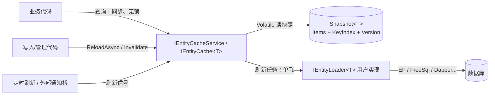

# 通用实体内存缓存组件（Entity Memory Cache）开发设计文档

| 项目 | 内容 |
| --- | --- |
| 目标框架 | .NET 8.0 |
| 形态 | 进程内通用内存缓存类库（NuGet 组件） |
| 文档版本 | v0.1（草稿，供评审与共同开发） |
| 日期 | 2026-09-08 |
| 状态 | 待评审 |
| 工程进度 | M0–M5 完成（2026-09-08）；全部源码注释已中文化 |
| 来源需求 | `docs/设计思路.txt` |

> 本文档基于原始设计思路整理，并对其做了若干修正与补充（详见第 1.4 节）。
> 所有接口签名、配置项与目录结构均为“建议草案”，评审后以本文档更新版本为共同开发依据。

## 1. 背景与目标

### 1.1 背景

程序运行过程中存在大量“开关、配置”类查询。这类数据的特点是：

- 单表数据量小（开关表、配置表通常只有几十到几万行）；
- 变化频率低（偶尔变更）；
- 读取频率极高，且绝大多数读取得到的结果与上一次相同；
- 每一次读查询都会打到数据库，造成大量无意义的 IO。

原始设想：由 ORM 在合适的时机把指定表**全量加载**到进程内缓存中，业务查询只读内存；
数据变更时再触发**部分加载（单类）或全量加载（全部注册类）**刷新缓存。

### 1.2 目标范围（v0.1）

1. 提供基于 .NET 8 的内存缓存类库，缓存**表级镜像**数据（不是细粒度 key-value 缓存）。
2. **ORM 无关**：组件本身不依赖 EF Core / FreeSql / SqlSugar / Dapper 等任何 ORM；
   数据如何从数据库读出由使用方通过“加载器”提供。
3. 注册简单：一行扩展方法开启服务 + 按实体类型声明缓存项；
   支持**特性标记**（`[CacheEntity]`）与程序集扫描方式自动发现实体。
4. 服务以 **Singleton** 注册，对外提供：
   - 类型化查询接口；
   - 加载/刷新接口：支持**部分刷新**（指定实体类）与**全量刷新**（全部注册类）。
5. 查询走无锁快照读，刷新走异步单飞（single-flight），加载失败时保留最后一份可用数据。
6. 提供基础的失效通知、可选定时刷新、日志与指标，便于生产使用。

### 1.3 非目标（本期明确不做）

| 不做 | 原因/说明 |
| --- | --- |
| 分布式缓存 / Redis / 多进程共享 | 组件定位进程内；多实例一致性留扩展点（见 10 节） |
| 逐条过期、LRU、容量淘汰 | 缓存对象是“表镜像”，不是逐 key 缓存 |
| 写穿（write-through）、双写一致性 | 数据库仍是唯一事实源，缓存只做镜像 |
| 自动感知数据库变更（CDC / 触发器） | v0.1 通过“显式通知 + 可选轮询”刷新 |
| 跨实体的事务性一致快照 | 各表按自身节奏加载；跨表强一致需另行设计 |
| 大表 / 超大结果集 | 组件面向开关、配置等小表；超阈值仅告警不逐出 |

### 1.4 相对原始思路的调整与补充

| 原始思路 | 本文档建议 | 理由 |
| --- | --- | --- |
| 接口对外暴露查询和加载 | 拆成服务级（`IEntityCacheService`）+ 类型级（`IEntityCache<TEntity>`）两层 | 调用方更清晰；可按单类注入 |
| ORM“最好可配置” | 完全 ORM 无关：只定义 `IEntityLoader<TEntity>` / 加载委托 | 核心包零第三方依赖，接入成本最低 |
| 特性标记哪些类进缓存 | 特性只表达“元数据与约定”（键、刷新策略等），实际加载逻辑仍需显式提供 | 特性无法替你写 SQL；避免误导 |
| 未明确并发模型 | 明确“无锁快照读 + 单飞刷新 + 失败保留旧数据” | 读多写极少场景的最优解，杜绝并发放大 |
| 未明确变更感知方式 | 提供 `Invalidate` / `ReloadAsync` / 可选定时刷新三档 | 覆盖“写入方主动通知”和“兜底轮询”两种诉求 |
| 单工程 | 建议拆分 Abstractions 与实现两个工程 | 领域层引用特性/接口时不必引入实现程序集，便于未来发 NuGet |

## 2. 术语与约定

| 术语 | 含义 |
| --- | --- |
| 实体（Entity） | 对应一张小表/一组配置的 POCO，例如 `AppSwitch` |
| 快照（Snapshot） | 某一次成功加载后形成的**不可变**数据集（条目数组 + 键索引 + 版本号） |
| 版本（Version） | 每次成功刷新 +1，用于观察/诊断“数据是否换过” |
| 缓存项（Cache Entry） | 对一个已注册实体类维护的 `IEntityCache<TEntity>` |
| 加载器（Loader） | 使用方实现的取数逻辑，内部可任选 ORM |
| 失效（Invalidate） | 通知缓存“数据库数据已变”，按策略触发或等待刷新 |
| 单飞（Single-flight） | 同一时刻同一实体只执行一次刷新，并发调用共享同一次结果 |
| 部分加载 | 只刷新指定实体类型 |
| 全量加载 | 刷新所有已注册实体类型 |

## 3. 总体设计

### 3.1 设计原则

1. **读无锁、写异步**：查询只做内存快照读；刷新是异步任务，绝不阻塞查询。
2. **存储与取数分离**：核心包只管“存、查、刷”，取数交给用户加载器。
3. **失败可降级**：刷新失败保留上一份快照，系统继续可用并记录错误。
4. **数据库为唯一事实源**：缓存不做写透；谁改数据谁负责通知刷新。
5. **约定优于配置、显式优于隐式**：`Id` 默认键等约定 + 可显式覆盖。
6. **面向小表**：不做淘汰算法，但提供容量告警阈值，防止误用造成内存膨胀。

### 3.2 总体架构



### 3.3 核心刷新流程

```mermaid
sequenceDiagram
    autonumber
    participant Caller as 业务/调度代码
    participant Cache as EntityCache&lt;T&gt;
    participant Loader as IEntityLoader&lt;T&gt;(用户ORM实现)

    Caller->>Cache: ReloadAsync() / EnsureFreshAsync()
    Cache->>Cache: 快照是否新鲜？(未过期且非 stale)
    alt 无需刷新
        Cache-->>Caller: 直接返回当前快照版本
    else 需要刷新
        Cache->>Cache: 单飞：已有刷新在跑则等待其结果
        Cache->>Loader: LoadAsync(ct)
        Loader-->>Cache: 返回 IReadOnlyCollection&lt;T&gt;
        Cache->>Cache: 构建键索引并校验重复键
        Cache->>Cache: 生成新快照(Version+1)，原子交换
        Cache-->>Caller: 刷新完成
    end
```

### 3.4 与备选方案对比（为什么不自研/不直接用现成组件）

| 方案 | 优点 | 与本方案差异 |
| --- | --- | --- |
| .NET 内置 `IMemoryCache` | 现成、支持过期/逐出 | 面向任意 key 的单条缓存，需要调用方自行维护“整表重载、索引、版本、单飞”，缺少表级镜像语义 |
| 手写静态 `ConcurrentDictionary` | 简单 | 生命周期、类型注册、事件、指标、失败降级都要重复实现，且易把可变集合直接暴露给调用方 |
| 数据库行级缓存中间件 | 通用 | 粒度太细，控制不了“整表一次加载 + 类型化查询”的业务模型 |

结论：自研一个“小表镜像 + 类型化查询”的薄组件是合理的；核心价值在**语义与并发模型**，而不是存储结构本身。

## 4. 功能设计

### 4.1 核心抽象（建议命名）

> 命名空间/程序集前缀先使用占位 `MemoryCache.*`，正式发布前可整体替换为公司前缀
> （例如 `Nebula.Caching.*`），成本极低，见第 8 节决策项 D1。

```csharp
// ---------- MemoryCache.Abstractions ----------

/// <summary>实体级缓存：查询与单类刷新。</summary>
public interface IEntityCache<TEntity> where TEntity : class
{
    long Version { get; }                    // 成功刷新次数（自增）
    int Count { get; }                       // 当前条目数
    bool IsStale { get; }                    // 已被标记失效但尚未成功刷新
    DateTimeOffset? LoadedAt { get; }        // 最近一次成功加载时间
    Exception? LastError { get; }            // 最近一次刷新失败原因

    IReadOnlyList<TEntity> GetSnapshot();    // 只读快照（表镜像）
    IQueryable<TEntity> AsQueryable();       // LINQ 内存查询入口

    bool ContainsKey(object key);
    bool TryGetValue(object key, out TEntity? value);
    TEntity? GetByKey(object key);           // 未命中返回 null

    Task ReloadAsync(CancellationToken ct = default);      // 强制刷新
    Task EnsureFreshAsync(CancellationToken ct = default); // 过期/失败才刷新

    event EventHandler<EntityCacheReloadedEventArgs<TEntity>>? Reloaded;
}

/// <summary>加载器：使用方实现，内部可任选 ORM。</summary>
public interface IEntityLoader<TEntity> where TEntity : class
{
    Task<IReadOnlyCollection<TEntity>> LoadAsync(CancellationToken ct);
}

/// <summary>服务级缓存：注册、类型化获取、部分/全量刷新、失效通知。</summary>
public interface IEntityCacheService
{
    IEntityCache<TEntity> Get<TEntity>() where TEntity : class;
    bool IsRegistered<TEntity>() where TEntity : class;
    IReadOnlyCollection<Type> RegisteredTypes { get; }

    Task ReloadAsync<TEntity>(CancellationToken ct = default) where TEntity : class; // 部分加载
    Task ReloadAsync(Type entityType, CancellationToken ct = default);
    Task ReloadAllAsync(CancellationToken ct = default);                            // 全量加载

    void Invalidate<TEntity>() where TEntity : class; // 见 4.8 失效语义
    void Invalidate(Type entityType);
}

public sealed class EntityCacheReloadedEventArgs<TEntity> : EventArgs
{
    public long PreviousVersion { get; init; }
    public long NewVersion { get; init; }
    public bool Failed { get; init; }
    public Exception? Error { get; init; }
}
```

实现侧（内部，不对外暴露）：

- `EntityCacheService`：单例，维护 `ConcurrentDictionary<Type, IEntityCache>`；
- `EntityCache<TEntity>`：单实体缓存实现，内部持有 `CacheSnapshot<TEntity>` 字段；
- `CacheSnapshot<TEntity>`：不可变对象（条目数组 + 只读键索引 + Version + LoadedAt）；
- `EntityCacheHostedService`：启动预热（可选）；
- `EntityCachePeriodicRefresher`：定时刷新（可选）。

### 4.2 快照与一致性模型

**快照结构（内部）**

```csharp
internal sealed class CacheSnapshot<TEntity>
{
    public required IReadOnlyList<TEntity> Items { get; init; }      // 数组
    public required IReadOnlyDictionary<object, TEntity> Index { get; init; }
    public required long Version { get; init; }
    public required DateTimeOffset LoadedAt { get; init; }
}
```

**并发与一致性承诺**

| 场景 | 行为 |
| --- | --- |
| 多个读者并发查询 | 无锁；`Volatile.Read` 取当前快照，读到的一定是某一次完整加载结果 |
| 刷新进行中 | 读者继续读旧快照；新快照构建完成后 `Volatile.Write` 原子替换 |
| 并发刷新同一实体 | 单飞：只有一个加载任务在跑，其余调用 await 同一个任务 |
| 刷新失败 | 旧快照保留；`LastError` 记录；Version 不变；按策略告警 |
| 跨实体一致性 | 不承诺；`ReloadAllAsync` 并发刷新各实体，各实体版本独立 |
| 实体可变性 | 默认约定“加载后按只读使用”，缓存直接保存引用、返回只读列表；不做逐项克隆 |

> 关于“克隆”：配置实体数量小、读取极频繁，逐次克隆代价高且很少被需要。
> 如果业务必须修改缓存内对象，v0.2 再提供 `CloneOnRead` 扩展（实现可选接口或委托），本期不引入。

### 4.3 键（Key）设计

键用于 O(1) 定位，例如“按 Code 查开关”。规则如下：

1. **默认**：实体存在名为 `Id` 的属性时以 `Id` 为键；
2. **特性指定**：`[CacheEntity(KeyProperty = "Code")]`；
3. **复合键**：`KeyProperty = "TenantId,Code"`（内部归一化为 ValueTuple 装箱）；
4. **委托覆盖**：注册时可 `WithKey(x => (x.TenantId, x.Code))`，优先级最高；
5. 未配置任何键的实体仍可注册，但键查询 API 调用时抛 `NotSupportedException`；
6. 键不允许为 `null`，加载时发现 null 键按错误处理并跳过/失败（按策略）。

重复键策略（可配置）：加载时发现两个条目键相同。

| 策略 | 行为 |
| --- | --- |
| `LogWarningAndKeepLast`（默认） | 记录警告，保留后加载的条目 |
| `KeepFirst` | 记录警告，保留先加载的条目 |
| `Throw` | 整个刷新失败，旧快照保留 |

### 4.4 特性标记

```csharp
[AttributeUsage(AttributeTargets.Class, Inherited = false)]
public sealed class CacheEntityAttribute : Attribute
{
    public string? KeyProperty { get; set; }     // 单键属性名；复合键用逗号分隔
    public string? Name { get; set; }            // 注册名/日志标签，默认取类型名
    public long CapacityWarningThreshold { get; set; } = 50_000; // 超过则告警
    public double RefreshIntervalSeconds { get; set; } = 0;      // 0 表示不启用定时
}
```

示例：

```csharp
[CacheEntity(KeyProperty = nameof(AppSwitch.Code))]
public sealed class AppSwitch
{
    public long Id { get; set; }
    public string Code { get; set; } = "";
    public string Value { get; set; } = "";
    public bool Enabled { get; set; }
}
```

特性只负责“元数据声明”，**不负责取数**；加载逻辑通过 4.5 的加载器提供。

### 4.5 注册与装配

入口扩展方法（一行开启）：

```csharp
// 建议命名为 AddEntityMemoryCache，避免与内置 IMemoryCache 的 AddMemoryCache 冲突
public static IServiceCollection AddEntityMemoryCache(
    this IServiceCollection services,
    Action<EntityCacheBuilder>? configure = null);
```

**方式 A：委托式注册（推荐用于快速接入）**

```csharp
services.AddEntityMemoryCache(builder =>
{
    builder.AddEntity<AppSwitch>(entity =>
        entity.WithKey(x => x.Code)
              .WithLoader(provider => new AppSwitchLoader(
                  provider.GetRequiredService<IDbContextFactory<AppDbContext>>()))
              .WithRefreshInterval(TimeSpan.FromMinutes(5)));
});
```

**方式 B：特性 + 程序集扫描 + DI 加载器**

```csharp
// 实体标记 [CacheEntity]；加载器注册到 DI
services.AddSingleton<IEntityLoader<AppSwitch>, AppSwitchLoader>();

services.AddEntityMemoryCache(builder =>
{
    // 扫描程序集中所有 [CacheEntity]，对应的 IEntityLoader<TEntity> 从 DI 解析
    builder.ScanAssembly(typeof(AppSwitch).Assembly);
});
```

扫描注册的校验规则（fail-fast）：

- 被扫描类型必须是 `class` 且标记 `[CacheEntity]`；
- 加载器 `IEntityLoader<TEntity>` 必须能在 DI 中解析，否则启动时抛出带实体名的清晰异常；
- 重复注册同一类型抛出 `InvalidOperationException`（启动期即可发现，避免相同实体
  被不同配置重复注册造成歧义；比“静默取第一次”更安全）。

**生命周期与 DbContext 的注意事项**：`IEntityCacheService` 是单例，而 EF Core `DbContext`
默认是 Scoped。因此组件在每次刷新时通过 `IServiceScopeFactory` 创建独立 DI 作用域来解析
加载器并立即释放；同时也建议用户用 `IDbContextFactory<TContext>`（官方推荐的单例友好方式）
实现加载器，两种方式组件都支持。

### 4.6 查询 API（读路径，永不打库）

```csharp
var switches = cacheService.Get<AppSwitch>();

AppSwitch? item = switches.GetByKey("Feature:Report");          // O(1) 键查询
bool ok = switches.TryGetValue("Feature:Report", out item);

IReadOnlyList<AppSwitch> all = switches.GetSnapshot();          // 整表镜像（只读）
var enabled = switches.AsQueryable()                            // LINQ 内存过滤
                      .Where(x => x.Enabled)
                      .ToList();

long v = switches.Version;                                      // 判断数据是否换过
```

查询 API 全部是同步的：它们只读快照，不触碰数据库、不会触发刷新、不做同步等待。
需要“保证看到最新”的调用方应先 await `ReloadAsync`/`EnsureFreshAsync`，再读。

### 4.7 加载/刷新 API（写路径，异步）

| API | 粒度 | 说明 |
| --- | --- | --- |
| `ReloadAsync<TEntity>()` | 部分 | 强制刷新单个实体 |
| `ReloadAsync(Type)` | 部分 | 同上，运行时类型版（例如来自消息通知） |
| `ReloadAllAsync()` | 全量 | 并行刷新全部已注册实体（并行度可配置） |
| `EnsureFreshAsync<TEntity>()` | 部分 | 仅在“从未加载 / 标记失效 / 上次失败”时刷新 |
| 启动预热 | 全量 | 可选：Host 启动后异步预热全部实体 |

并发语义：

- 同一实体并发触发刷新只执行一次加载（单飞）；
- `ReloadAllAsync` 按注册集合并行派发各实体刷新任务，单个实体失败不影响其他实体；
- 刷新过程中再次触发的请求会合并等待同一个结果，而不是排队重复执行。

### 4.8 失效与刷新策略

缓存不知道数据库何时变化，因此定义三层刷新入口，按场景选用：

```csharp
// 场景 1：业务代码自己改库（推荐主路径，语义最强）
await db.AppSwitches.Where(x => x.Code == code)
                    .ExecuteUpdateAsync(s => s.SetProperty(x => x.Value, value));
await cacheService.ReloadAsync<AppSwitch>();          // 只刷这一类

// 批量改了多个表
await cacheService.ReloadAllAsync();

// 场景 2：外部通知（消息队列、管理后台触发）——不知道谁改的库
cacheService.Invalidate<AppSwitch>();                  // 按失效策略处理
```

失效策略（每实体可配）：

| 模式 | `Invalidate` 行为 | 适用场景 |
| --- | --- | --- |
| `ReloadInBackground`（默认） | 立即标记 stale，并 fire-and-forget 触发后台刷新 | 开关表变更，希望尽快收敛 |
| `MarkStaleOnly` | 只标记 stale，等待下一次 `EnsureFreshAsync` / 显式刷新 | 刷新代价较高、可容忍滞后 |

补充策略：

- **定时刷新**：`WithRefreshInterval(TimeSpan)`，后台定时器兜底，防止“漏通知”导致长期陈旧；
- **启动预热**：`WarmupOnStartup=true`（默认），应用启动后异步全量加载，首个查询即命中内存；
- **启动失败策略**：`StartupFailurePolicy=Continue`（默认），预热失败不阻止应用启动，
  记录错误并由后续 `EnsureFreshAsync`/定时器自动重试；可选 `Throw` 改为启动即失败。

> 说明：为保证“读永不打库”，v0.1 不提供“读取时同步阻塞刷新”的选项，避免同步阻塞与
> 潜在的 sync-over-async 死锁。若业务要求“变更后下一次读必须看到新值”，应使用
> `await ReloadAsync<T>()` 的写路径语义，而不是依赖读路径。

### 4.9 配置项汇总

**全局（`EntityCacheOptions`）**

| 配置 | 默认 | 说明 |
| --- | --- | --- |
| `WarmupOnStartup` | `true` | 启动后异步预热 |
| `WarmupTimeout` | `30s` | 预热总超时（null 表示不超时） |
| `StartupFailurePolicy` | `Continue` | 预热失败：继续启动 / 抛出 |
| `ReloadAllMaxDegreeOfParallelism` | `min(4, CPU数)` | 全量刷新并行度 |
| `EnableMetrics` | `true` | 启用 `System.Diagnostics.Metrics` |

**实体级（`EntityCacheEntityOptions<TEntity>`）**

| 配置 | 默认 | 说明 |
| --- | --- | --- |
| `KeyProperty` / `KeySelector` | `Id` 惯例 | 键来源，见 4.3 |
| `InvalidationMode` | `ReloadInBackground` | `Invalidate` 后的行为 |
| `RefreshInterval` | 不启用 | 后台定时刷新周期 |
| `ReloadOnStartup` | `true` | 是否参与启动预热 |
| `DuplicateKeyPolicy` | `LogWarningAndKeepLast` | 重复键处理 |
| `CapacityWarningThreshold` | 50,000 | 条目数超阈值告警 |
| `LoadTimeout` | `null` | 单次刷新超时（null 不超时） |
| `OnLoadError` | `null` | 自定义刷新失败回调 |

### 4.10 日志、错误与可观测性

**日志（`ILogger<EntityCacheService>`）**

- Debug：刷新开始/结束（实体、耗时、新旧版本）；
- Warning：刷新失败（保留旧快照）、重复键、容量超阈值；
- Information：启动预热结果汇总。

**事件（订阅者可在进程内响应）**

- `IEntityCache<T>.Reloaded`：某实体刷新成功/失败，携带新旧版本；
- `IEntityCacheService.Invalidated`：收到失效通知（供运维/监控使用）。

**指标（Meter，标签含实体类型）**

| 指标 | 类型 | 说明 |
| --- | --- | --- |
| `memorycache.reloads_total` | Counter | 刷新次数（成功/失败分开计数） |
| `memorycache.reload_duration_seconds` | Histogram | 刷新耗时 |
| `memorycache.snapshot_items` | Gauge | 当前条目数 |
| `memorycache.registered_types` | Gauge | 注册实体数 |

## 5. 工程结构规划

现有解决方案只有一个空工程 `MemoryCache/MemoryCache.csproj`，建议调整为：

```text
MemoryCache.sln
├─ docs/
│  ├─ 设计思路.txt                  # 原始需求（保留）
│  └─ 开发设计文档.md               # 本文档（共同开发期间持续更新）
├─ src/
│  ├─ MemoryCache.Abstractions/     # 纯契约：特性、接口、事件，零依赖
│  │   ├─ CacheEntityAttribute.cs
│  │   ├─ IEntityCacheService.cs
│  │   ├─ IEntityCache.cs
│  │   ├─ IEntityLoader.cs
│  │   └─ Events/ ...
│  └─ MemoryCache/                  # 实现：快照、注册、刷新、预热、定时器
│      ├─ EntityCacheService.cs
│      ├─ EntityCache.cs
│      ├─ CacheSnapshot.cs
│      ├─ Options/ ...
│      ├─ Registration/ ...
│      └─ Hosting/ ...
├─ tests/
│  └─ MemoryCache.Tests/            # xUnit：单元 + 并发 + 集成
└─ samples/
   └─ MemoryCache.Sample/           # 控制台/ASP.NET Core 演示（EF Core + 假数据源）
```

拆分理由：

- 领域/实体项目只需要引用 `Abstractions` 就能写 `[CacheEntity]`，不引入实现依赖；
- 实现包后续可独立发版；
- 现阶段也可先保持单工程、按文件夹分层，待功能稳定再拆（里程碑 M0 决定）。

> 独立 ORM 适配包（如 `MemoryCache.EntityFrameworkCore`）暂不做：加载器委托已覆盖
> 90% 场景，等出现重复样板代码再考虑官方适配。

## 6. 测试与质量策略

**单元测试**

- 快照替换的原子性：并发读者读到的一定是完整旧版或完整新版；
- 键索引：单键/复合键/缺省键/null 键；
- 重复键三种策略；
- 刷新失败保留旧快照且 Version 不变；
- `EnsureFreshAsync` 幂等性。

**并发测试**

- 100 并发读者 + 10 轮刷新的压力场景下无异常、无撕裂读；
- 100 个并发 `ReloadAsync` 只执行一次 loader（用计数器断言单飞）；
- 刷新失败期间查询仍可用。

**集成测试**

- `ScanAssembly` + DI 加载器注册 + 预热顺序；
- `Invalidate` 两种模式的行为差异；
- 定时刷新与 Hosted Service 启停。

**基准（BenchmarkDotNet，可选）**

- `GetByKey` / `GetSnapshot` 在 1k / 10k / 100k 条目下的吞吐；
- 1000 并发刷新的单飞放大系数。

## 7. 里程碑与任务拆解

| 里程碑 | 内容 | 验收标准 |
| --- | --- | --- |
| M0 骨架 | 调整工程结构；Abstractions 契约 + 实现包空壳；测试工程跑通 | `dotnet build` + 空测试通过 |
| M1 注册与装配 | `AddEntityMemoryCache`、委托加载器、`ScanAssembly`、DI 作用域解析 | 两种注册方式均能启动并暴露服务 |
| M2 快照与查询 | 快照存储、键索引、查询 API、Version/事件 | 单测覆盖一致性模型 |
| M3 刷新语义 | 部分/全量刷新、单飞、预热、`Invalidate`、定时刷新、失败策略 | 并发测试全绿 |
| M4 示例与集成 | EF Core 示例（`IDbContextFactory` + `AsNoTracking`）、集成测试 | 示例端到端可运行 |
| M5 收尾加固 | 指标/日志、XML 文档注释、NuGet 元数据、基准 | 文档与代码同步，可打包 |

每完成一个里程碑即回到本文档更新状态，再进入下一阶段。

> **当前进度**：M0（工程骨架 + Abstractions 契约接口）与 M1（注册与装配）已完成：
> 解决方案已按 `src/MemoryCache.Abstractions`、`src/MemoryCache`、`tests/MemoryCache.Tests`
> 调整完毕。M2 已实现：不可变快照原子替换、Version/LoadedAt/LastError、
> 单键与复合键索引（支持元组查询）、加载器按 DI 作用域解析、单飞刷新、
> 失败保留旧快照、重复键策略、失效标记与后台刷新、Reloaded 事件。
> 新增 MySQL 样例 `samples/MemoryCache.Sample`（本地 job_config 表，复合主键
> GROUP+JOB_KEYNAME）已端到端跑通；共 30 个测试全部通过。
> M3 已实现：全局服务选项（预热开关/预热超时/失败策略/全量刷新并行度）、
> 启动预热 Hosted Service、按实体周期执行的定时刷新 Hosted Service
> （单次刷新失败不影响后续周期），共 36 个测试全部通过。
> M4 已完成：新增 EF Core 示例 `samples/MemoryCache.Sample.EFCore`
> （Pomelo + MySQL、`AddPooledDbContextFactory` + `IDbContextFactory` +
> `AsNoTracking`，通过 `[CacheEntity]` + `ScanAssembly` 自动装配加载器），
> 已在本机 MySQL `quartz.job_config` 上端到端跑通。
> M5 已完成：启用 `System.Diagnostics.Metrics`（reloads_total / reload_duration_seconds /
> snapshot_items / registered_types，可用 `WithMetrics(false)` 关闭）、补齐包元数据与
> README、`dotnet pack` 产出 `MemoryCache.0.1.0` 与 `MemoryCache.Abstractions.0.1.0`
> （含 XML 文档与 README），并新增轻量基准工程
> `benchmarks/MemoryCache.Benchmark`（1 万条目下键查询约 4.6M ops/s、
> 快照读取约 128M ops/s）。测试共 37 个全部通过。

## 8. 决策记录与待定问题

| 编号 | 决策项 | 建议默认 | 待确认 |
| --- | --- | --- | --- |
| D1 | 命名空间/包名 | `MemoryCache.*` 占位 | 是否加公司/产品前缀（如 `Nebula.Caching.*`） |
| D2 | 是否拆分 Abstractions | 拆（M0 执行） | 是否坚持单包 |
| D3 | 失效主路径 | 写入方 `await ReloadAsync<T>()`；`Invalidate` 后台刷新兜底 | 是否要求“读触发刷新”语义 |
| D4 | 键表达 | `Id` 惯例 + 特性/委托覆盖；复合键支持 | 是否需要强类型泛型键 API |
| D5 | 实体可变性 | 只读约定、不克隆 | 是否需要 `CloneOnRead` |
| D6 | 预热失败策略 | `Continue` + 自动重试 | 生产上是否要求启动强校验 |
| D7 | 重复键策略 | 告警并保留最后一条 | 是否需要默认 `Throw` |
| D8 | 测试框架 | xUnit | 是否偏好 NUnit / MSTest |
| D9 | 定时刷新 | 默认关闭、可配 | 是否需要“数据库版本号比对”的增量刷新 |

## 9. 风险与缓解

| 风险 | 影响 | 缓解 |
| --- | --- | --- |
| 变更到读新值存在滞后窗口 | 读到旧开关/配置 | 写入方主动 await 刷新；必要时加定时兜底 |
| 加载器返回 EF 跟踪实体 | 快照被 DbContext 状态污染 | 文档与示例强制 `AsNoTracking`；加载器用 `IDbContextFactory` |
| 误用大表注册 | 内存膨胀 | 容量告警阈值 + 指标监控 |
| 多实例部署各自缓存不一致 | 同服务多副本读到不同配置 | 明确进程内定位；预留外部通知桥（MQ→`Invalidate`）扩展点 |
| 预热失败静默 | 首个查询命中空缓存 | `LastError` + 指标 + 可选 `StartupFailurePolicy.Throw` |
| 单飞实现错误导致刷新放大 | 数据库被打爆 | 并发测试断言 loader 只执行一次 |

## 10. 附录：端到端示例（建议进入代码阶段的起点）

```csharp
// ---- 实体 ----
[CacheEntity(KeyProperty = nameof(AppSwitch.Code))]
public sealed class AppSwitch
{
    public long Id { get; set; }
    public string Code { get; set; } = "";
    public string Value { get; set; } = "";
    public bool Enabled { get; set; }
}

// ---- 加载器：ORM 由使用方自选，此处为 EF Core ----
public sealed class AppSwitchLoader(IDbContextFactory<AppDbContext> dbFactory)
    : IEntityLoader<AppSwitch>
{
    public async Task<IReadOnlyCollection<AppSwitch>> LoadAsync(CancellationToken ct)
    {
        await using var db = await dbFactory.CreateDbContextAsync(ct);
        return await db.AppSwitches.AsNoTracking().ToListAsync(ct);
    }
}

// ---- 注册：一行开启 ----
services.AddSingleton<IEntityLoader<AppSwitch>, AppSwitchLoader>();
services.AddEntityMemoryCache(builder => builder.ScanAssembly(typeof(AppSwitch).Assembly));

// ---- 使用 ----
var switches = cacheService.Get<AppSwitch>();
bool open = switches.GetByKey("Feature:Report")?.Enabled == true;

// ---- 变更后刷新 ----
await UpdateSwitchValueAsync(code, newValue);
await cacheService.ReloadAsync<AppSwitch>();
```
